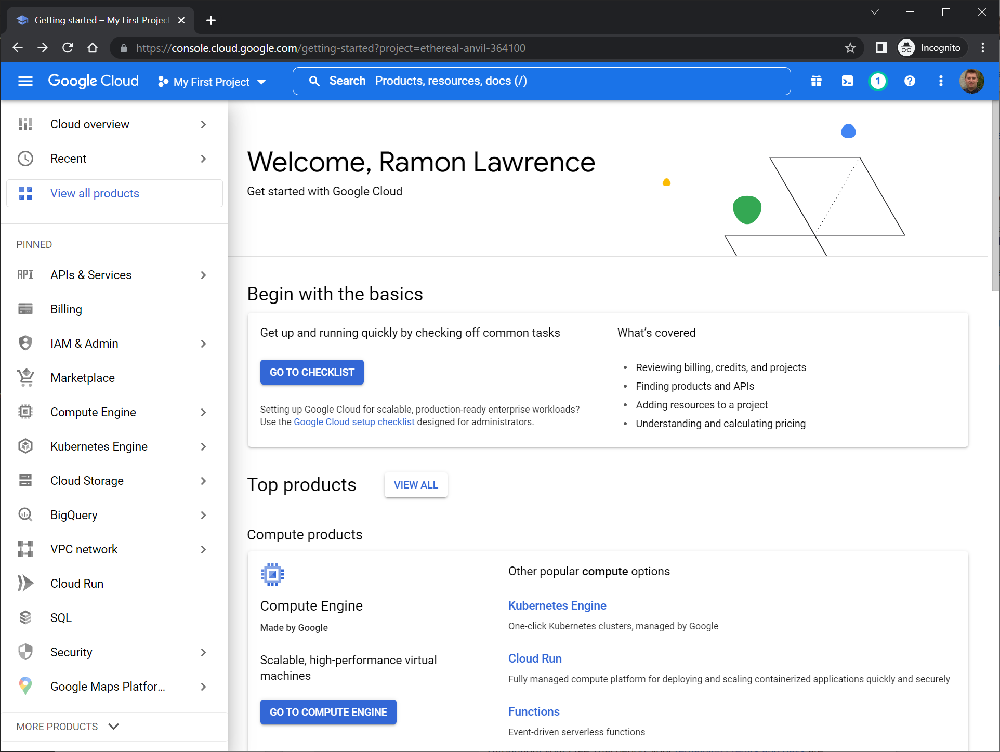

# COSC 516 - Cloud Databases Lab 3 - Google Cloud Bigtable

## Setup

Create a Google Cloud free tier account at: [https://azure.microsoft.com/en-us/free/](https://azure.microsoft.com/en-us/free/).

The free tier account allows for free trials forever and 12-months free offers from your sign up period. You will need an email address to use. 

## Google Cloud Portal

Login to Google Cloud. In the Google Cloud Portal, click on `More services` then select `Databases` category. Select `Azure SQL`.

## Create Google Cloud Bigtable Instance

Click on `Create SQL database`. Select first option with `Single database` and click `Create`. 

For `Resource group` click `Create new` and use name `rg516`. For `Database name` use `cosc516`.

For `Server` click `Create new` and use name `sqlserver516`. For authentication select `Use SQL authentication`. For user id, use `cosc516` and select your password. For `Location` use `Canada Central`.

Under `Compute + storage`, you can leave as `Standard S0`. Alternatively, you can click `Configure database` and change to `Basic DTU-based purchasing model`. 

Click `Next: Networking`. On `Connectivity method` select `Public endpoint`. Click `Yes` to `Add current client IP address`. Leave with `Default Connection policy`. Click `Review + create`. Click `Create`.

## Connecting to the Instance

Connecting to the database can be done using Google Cloud Portal and by using code.

### Accessing using SQuirreL

Google Cloud Bigtable is not a relational database and is **NOT** accessible using SQuirreL or other SQL tools.

## Tasks

To test your database, write Java code using VS Code. The file to edit is `Bigtable.java`.  The test file is `TestBigtable.java`.  Fill in the methods requested (search for **TODO**).  Marks for each method are below.  You receive the marks if you pass the JUnit tests AND have followed the requirements asked in the question (including documentation and proper formatting).

- +1 mark - Write the method `connect()` to make a connection to the database.
- +5 marks - Write the method `load()` to load the sensor data into the database. The data files are in the [data](data) folder. 
- +1 mark - Write the method `close()` to close the connection to the database.
- +3 marks - Write the method `query1()` that returns ....
- +3 marks - Write the method `query2()` that returns ...
- +3 marks - Write the method `query3()` that returns ...
- +4 marks - Write the method `query4()` that returns ...

**Total Marks: 20**

## Bonus Marks: (up to 2)

Up to +2 bonus marks for demonstrating some other feature of Google Cloud Bigtable.

## Submission

The lab can be marked immediately by the professor or TA by showing the output of the JUnit tests and by a quick code review.  Otherwise, submit the URL of your GitHub repository on Canvas. **Make sure to commit and push your updates to GitHub.**

